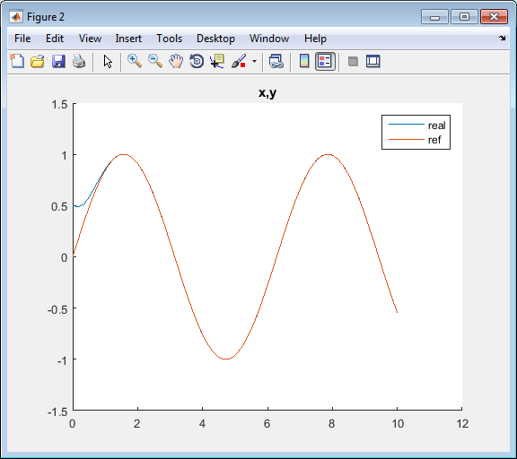

# Dynamic-Feedback-Lineariz-diff-robot-tracking
A Dynamic Feedback Linearization for a differential wheeled robot for tracking any continous trajectory in plane with asymptotic stability.

Learning this topic, I just programed this to watch it's effectivity in a very particular case (wheeled robot).
DFL is really useful when you have at least two inputs. It is useless in case of one input, being the same as classic Feedback Linearization, or "Static" Feedback Linearization. Further reading in folder "References".

So, supposing we know the model perfectly, we can make DFL to the robot, defining the old input, the linear velocity, as a "virtual" state variable: The new input will be its derivative, so the controller will be integrating always the new input to get the linear velocity. Let's note that the robot must never stop: If we have *v=0*, we will have a singularity in *w*. Finally, perfect tracking in plane *x,y* is achieved.

